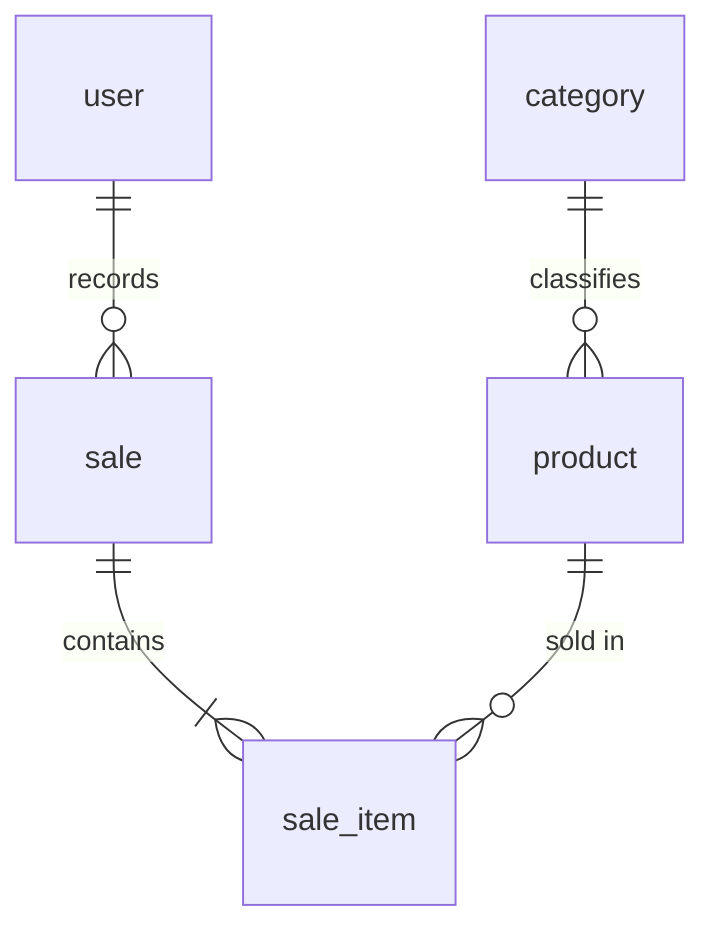

# Domain — Simple Stock Flow

Source: `spec/data-model.md` (DM); status labels reflect what that source states, not a new validation of the database engine.

## Glossary

| Concept | Definition | Source |
|---|---|---|
| Product | Catalog item with a name, price, stock, category, and optional image | DM §1 |
| Category | Fixed classification with five seeded values | DM §§1, 2.1, 9 |
| Sale | A completed, immutable fact: operator, time, and products sold | DM §1 |
| Sale item | Product, quantity, and frozen price; exists only within a sale | DM §§1, 2.4 |
| Frozen price | Copy of the price in effect when the sale was made | DM §1 |
| Total/subtotal | Derived sums, not persisted columns | DM §1 |
| User | Internal operator with the `admin` or `seller` role | DM §§1, 2.5 |
| Report | Read aggregation by product and date range; not persisted | DM §§1, 6 |

## Entities and aggregates

| Entity | Role | Main rules |
|---|---|---|
| `Category` | Reference data, not a root | Unique name enforced by the engine; five seeds; read-only (DM §2.1) |
| `Product` | Catalog root | Non-empty, trimmed name; price > 0; stock >= 0; withdrawal cannot exceed availability; existing category; absent image is `NULL`; soft delete (DM §2.2) |
| `Sale` | Sales root | At least one line; no duplicate product; required operator; immutable; adding a line and deducting stock form one operation (DM §2.3) |
| `SaleItem` | Internal entity of `Sale` | Quantity > 0; frozen name/price; cannot be constructed externally (DM §2.4) |
| `User` | Identity root | Unique/normalized username; required hash; closed role set; plaintext password stays outside the domain (DM §2.5) |

`Money` rounds to 2 decimal places using `AwayFromZero`; it accepts zero, although a product requires a positive price. `Quantity` must be strictly positive. The system uses one currency (DM §§2.2–2.4, 3).

## Relationships

A category classifies products; a sale contains sale items; each item references a product. A sale is attributed to a user, but the `sale.sold_by_user_id` FK remains pending T-12 (DM §§3, 5, 13). According to the later status in §13, T-20 made `sale_item.sale_id` non-null and added a product FK and unique index; the 2026-09-19 queries are earlier snapshots.

## Invariants

1. `Product.price > 0`; `stock >= 0`; do not withdraw more than is available (DM §2.2).
2. A sale can be confirmed only with at least one line; a product appears at most once; the sale and stock deduction are coordinated (DM §2.3).
3. Quantity is positive and a sale item contains a product snapshot. The frozen category name depends on T-11, whose status is unresolved in the source (DM §§2.4, 3).
4. A confirmed sale cannot be edited or deleted (DM §§1, 7.1).
5. Username is normalized; roles are valid; never expose the password hash (DM §§2.5, 7).
6. Images are external and referenced by an opaque key; use `NULL` when no image exists (DM §§1, 2.2, 3).
7. A report uses a valid date range, is read-only, and is not broken down by seller (DM §§1, 7.1, 12).

## Domain events

The model defines no formal events or publishing mechanism. The following are **proposed conceptual events**, not implementations:

| Proposed event | When it occurs | Status |
|---|---|---|
| `ProductCreated` | Product is created | Assumption DOM-01; no contract exists in the source |
| `StockRestocked` / `StockWithdrawn` | Apply `Restock` / `Withdraw` | Assumption DOM-02; the method names do appear in DM §2.2 |
| `SaleRecorded` | Sale is confirmed and stock updated | Assumption DOM-03; does not imply event sourcing |
| `ProductImageChanged` | Change key and coordinate the binary file | Assumption DOM-04; sequence described in DM §7.1 |

## Database-engine rule vs. domain rule

DM classifies each rule as `engine`, `domain-only`, or `pending`. Manual SQL can bypass domain-only rules (DM §§0, 4). To describe the documented status, §13, dated 2026-09-20, takes precedence over the queries dated 2026-09-19. Those queries must be refreshed to verify the engine's current state.

## Ambiguities

- T-11 / `category_name` is marked pending in §3, but other sections use it as if it exists (§§2.4, 3, 11.1). The single available version cannot resolve this.
- `deleted_at`, `sale_id NOT NULL`, the product FK, and T-20 index have SQL evidence dated 2026-09-19 that predates changes recorded in §13 on 2026-09-20. The later status is adopted; the snapshot needs to be regenerated.
- A report grouped by frozen label may produce a different number of rows after a category rename; this conflicts with external acceptance criterion CA-06.1 (§11.1).
