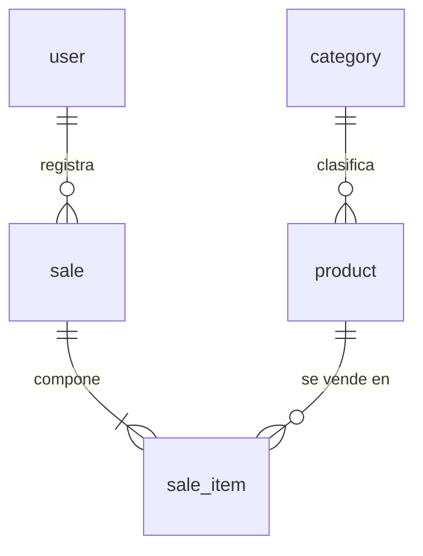

# Dominio — Simple Stock Flow

Fuente: `spec/data-model.md` (DM); las marcas de estado reflejan lo que esa fuente dice, no una validación nueva del motor.

## Glosario

| Concepto | Definición | Fuente |
|---|---|---|
| Producto | Artículo de catálogo con nombre, precio, stock, categoría e imagen opcional | DM §1 |
| Categoría | Clasificación fija de cinco valores sembrados | DM §§1, 2.1, 9 |
| Venta | Hecho consumado e inmutable: operador, momento y productos vendidos | DM §1 |
| Línea de venta | Producto, cantidad y precio congelado; solo existe dentro de venta | DM §§1, 2.4 |
| Precio congelado | Copia del precio vigente cuando se realizó la venta | DM §1 |
| Total/subtotal | Sumas derivadas, no columnas persistidas | DM §1 |
| Usuario | Operador interno con rol `admin` o `seller` | DM §§1, 2.5 |
| Reporte | Agregación de lectura por producto y rango, no persistida | DM §§1, 6 |

## Entidades y agregados

| Entidad | Papel | Reglas principales |
|---|---|---|
| `Category` | Referencia, no raíz | Nombre único en motor; cinco semillas; solo lectura (DM §2.1) |
| `Product` | Raíz catálogo | Nombre no vacío/recortado; precio > 0; stock >= 0; retiro no excede; categoría existente; imagen ausente `NULL`; baja lógica (DM §2.2) |
| `Sale` | Raíz venta | Al menos una línea; no repetir producto; operador obligatorio; inmutable; sumar línea y descontar stock como operación (DM §2.3) |
| `SaleItem` | Entidad interna de `Sale` | Cantidad > 0; nombre/precio congelados; no construir externamente (DM §2.4) |
| `User` | Raíz identidad | Username único/normalizado; hash obligatorio; rol cerrado; clave en claro fuera del dominio (DM §2.5) |

`Money` redondea a 2 decimales con `AwayFromZero`; acepta cero, aunque el producto exige precio positivo. `Quantity` es estrictamente positiva. El sistema es monomoneda (DM §§2.2–2.4, 3).

## Relaciones

Una categoría clasifica productos; una venta contiene líneas; cada línea referencia producto. La venta se atribuye a usuario, pero la FK `sale.sold_by_user_id` sigue pendiente T-12 (DM §§3, 5, 13). Según el estado posterior del §13, T-20 dejó `sale_item.sale_id` no nulable y añadió FK de producto e índice único; las consultas del 19-09 son snapshots anteriores.

## Invariantes

1. `Product.price > 0`; `stock >= 0`; no retirar más que lo disponible (DM §2.2).
2. Venta confirmable con al menos una línea; un producto aparece como máximo una vez; venta y descuento de stock van coordinados (DM §2.3).
3. Cantidad positiva y snapshot de producto en línea. El nombre de categoría congelado depende de T-11, cuyo estado no está resuelto en la fuente (DM §§2.4, 3).
4. Venta confirmada no se edita ni borra (DM §§1, 7.1).
5. Username normalizado; roles válidos; nunca exponer hash (DM §§2.5, 7).
6. Imagen externa bajo clave opaca; `NULL` cuando no hay imagen (DM §§1, 2.2, 3).
7. Reporte por rango válido, de lectura y no desglosado por vendedor (DM §§1, 7.1, 12).

## Eventos de dominio

El modelo no define eventos formales ni un mecanismo de publicación. Los siguientes son **eventos conceptuales propuestos**, no implementaciones:

| Evento propuesto | Ocasión | Estado |
|---|---|---|
| `ProductCreated` | Alta de producto | Supuesto DOM-01; no existe contrato en la fuente |
| `StockRestocked` / `StockWithdrawn` | Aplicar `Restock` / `Withdraw` | Supuesto DOM-02; nombres de métodos sí aparecen en DM §2.2 |
| `SaleRecorded` | Venta confirmada y stock actualizado | Supuesto DOM-03; no implica event sourcing |
| `ProductImageChanged` | Cambiar clave y coordinar binario | Supuesto DOM-04; secuencia en DM §7.1 |

## Regla del motor frente a regla de dominio

DM clasifica cada regla como `motor`, `solo dominio` o `pendiente`. SQL manual puede omitir las reglas solo de dominio (DM §§0, 4). Para describir el estado documental se prioriza §13, fechado el 20-09-2026, sobre las consultas del 19-09. Esas consultas deben actualizarse para verificar el motor hoy.

## Ambigüedades

- T-11 / `category_name` se marca pendiente en §3, pero otras secciones lo usan como si existiera (§§2.4, 3, 11.1). La única versión no permite resolverlo.
- `deleted_at`, `sale_id NOT NULL`, FK de producto e índice T-20 tienen pruebas SQL del 19-09 que preceden a los cambios declarados en §13 el 20-09. Se adopta el estado posterior; el snapshot necesita regenerarse.
- Reporte por etiqueta congelada no concuerda con CA-06.1 externo (§11.1).
